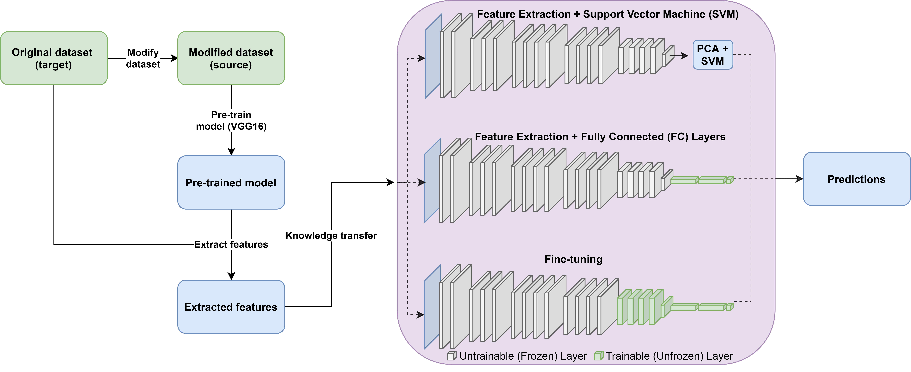

# transfer-medical-msc-2019

Repository for the MSc project of Colin (C.C.G.M.) Nieuwlaat.

## Project title

On the Impact of Dataset Shift on Transfer Learning Performance in Medical Image Classification

## Project aim
The code of this project can be used to modify datasets and perform different transfer learning methods on them. Also, the code can be used to detect dataset shift between two datasets.

## Experiment pipeline

# Running experiments
Before running any experiments, a configuration file has to be made. This can be done by running `create_config.py`.

The original datasets needs to be saved in the following hierarchy: 
* dataset_name
  * training
    * class 0
    * class 1
  * validation
    * class 0
    * class 1
  * test
    * class 0
    * class 1

Then, different scripts exist to run experiments:
* `modify_dataset.py`: Modify a dataset with one of various types of modifications, for a given fraction of images.
* `detect_shift.py`: Detect shift between two datasets, or between the training and test set of a dataset.
* `main.py`: Run deep learning experiments. Training mode can either be 'from_scratch', 'SVM', 'fc' or 'fine_tuning'. 
* `parsearch.py`: Script to perform randomized hyperparameter search to find optimal hyperparameters.
